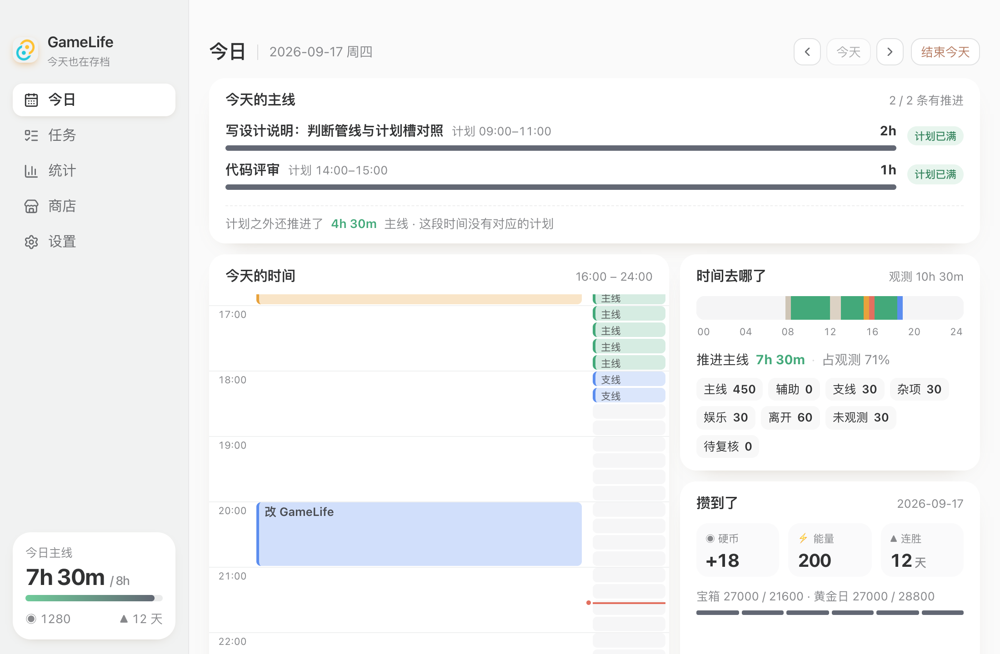
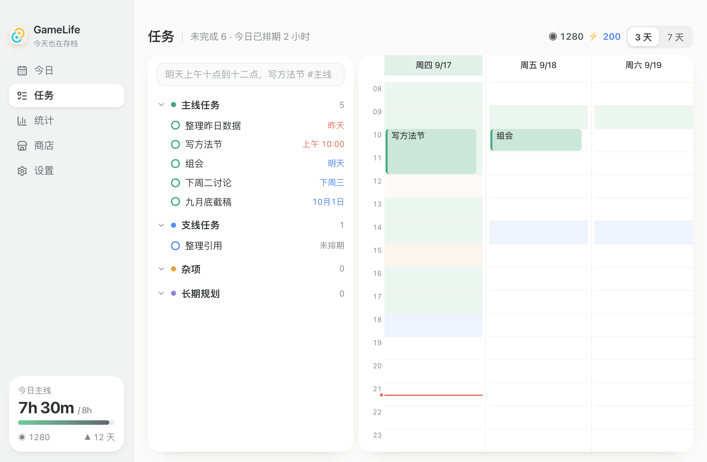
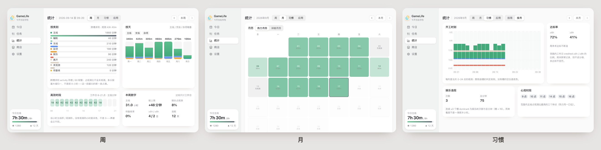
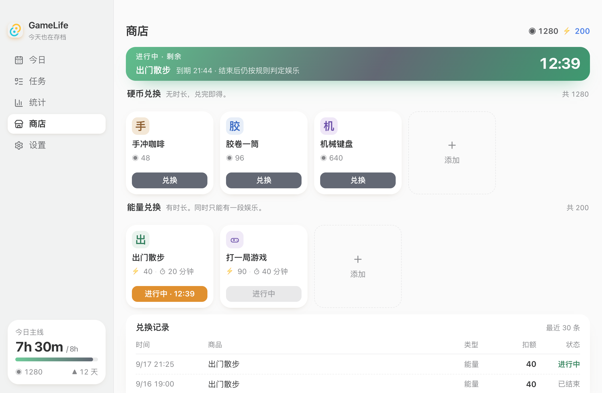
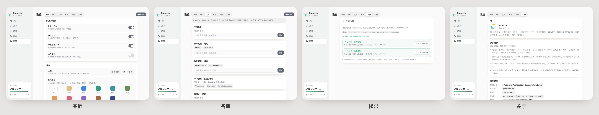
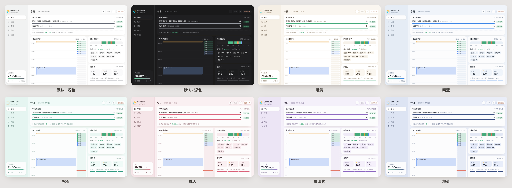
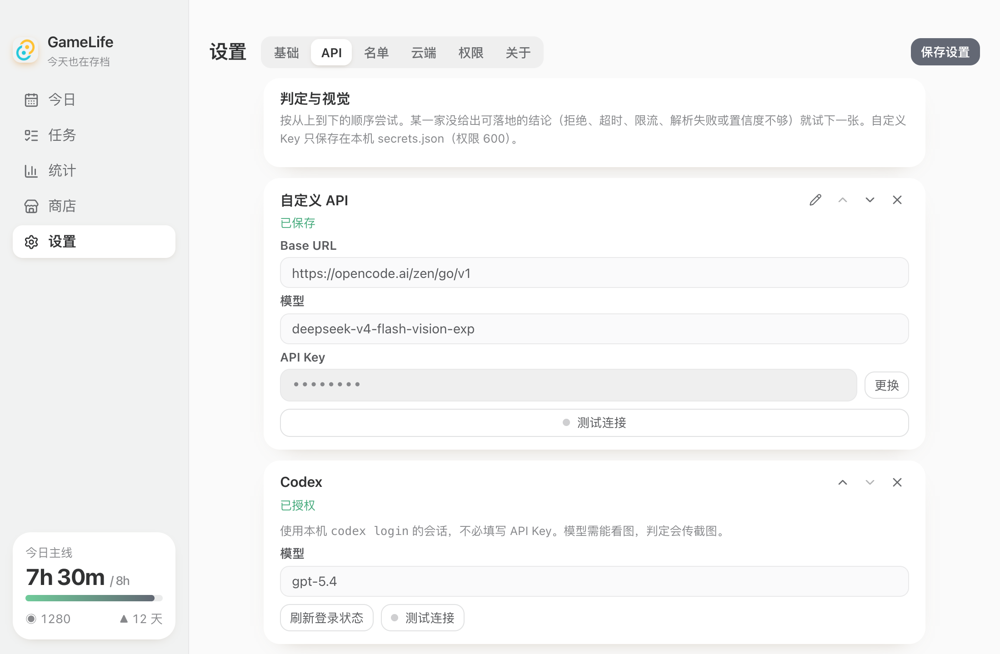
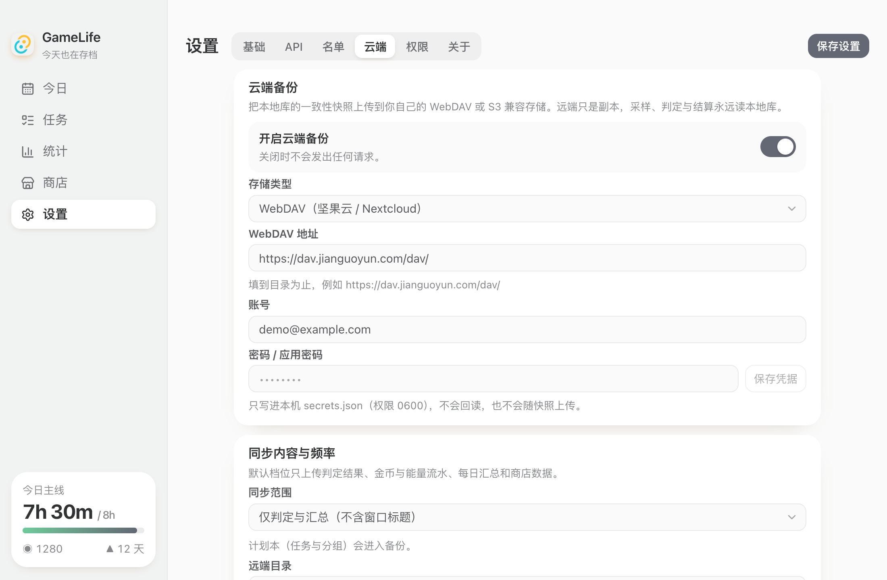

# GameLife

GameLife 是一个装在电脑上的**个人工作节奏与主线进度记录工具**。

做它的原因很简单：坐在电脑前一整天，并不代表真正推进了重要的事情。写论文、做实验可能只占其中一部分，剩下的时间很容易被邮件、杂项、个人项目，甚至看起来很“生产力”的支线工作占掉。

GameLife 想回答的不是“今天电脑用了多久”，而是：

> **今天真正推进主线工作的时间有多少？时间去了哪里？**

GameLife 每隔约 15 秒读取一次当前使用的**应用名称、窗口标题和文档信息**，并把一天切成 15 分钟的小格。它会结合当天安排的任务和本地分类规则，判断每一格属于主线、支线、杂项、娱乐、离开还是未观测。

大多数情况只依赖应用名称、窗口标题、文档路径和网页地址完成判断。对于仅靠这些信息无法可靠判断的灰区，可以选择配置 AI；必要时 GameLife 会截取**当前前台窗口**，交给你配置的视觉模型进一步判断。真正推进主线的时间会累计为进度，并获得硬币和能量，用于长期愿望和即时奖励。

任务、日程、活动记录和奖励数据默认保存在本机。**GameLife 本身没有用于收集个人数据的服务器；所有联网活动仅限于你主动配置的 AI API 判定，以及主动开启的 WebDAV / S3 云端备份。**

---

## 目录

- [💻 1. 支持的平台](#-1-支持的平台)
- [🖥️ 2. 界面与功能](#️-2-界面与功能)
  - [今日](#今日)
  - [任务](#任务)
  - [统计](#统计)
  - [商店](#商店)
  - [设置](#设置)
- [🚀 3. 安装与基础使用](#-3-安装与基础使用)
  - [安装 GameLife](#31-安装-gamelife)
  - [设置 macOS 权限](#32-设置-macos-权限)
  - [添加今天的任务](#33-添加今天的任务)
  - [设置 AI API](#34-设置-ai-api)
- [⚙️ 4. 进阶设置](#️-4-进阶设置)
  - [分类名单](#分类名单)
  - [数据保留](#数据保留)
  - [云端备份](#云端备份)
- [🛠️ 5. 自己编译](#️-5-自己编译)
- [🔒 6. 隐私与联网说明](#-6-隐私与联网说明)
- [⚠️ 7. 当前限制](#️-7-当前限制)
- [📄 8. License](#-8-license)

---

## 💻 1. 支持的平台

| 系统 | 状态 |
| --- | --- |
| **macOS（Apple Silicon）** | 可用。安装包见 [Releases](https://github.com/HaofeiMa/GameLife/releases)。 |
| **Windows 11** | 开发中，尚未进行真机测试。 |
| **Ubuntu（Xorg）** | 开发中，尚未进行真机测试。Wayland 下暂不支持自动观测当前窗口。 |

---

## 🖥️ 2. 界面与功能

GameLife 目前包含五个主要页面：

- 今日
- 任务
- 统计
- 商店
- 设置

### 今日

「今日」用于查看这一天真正发生了什么：

- 今天的主线有效时间与进度；
- 每个 15 分钟时段的活动判定；
- 主线、支线、杂项、娱乐、离开和未观测分别占用了多少时间；
- 今天已经排期的任务；
- 硬币、能量和连续记录。

时间轴中的红线表示当前时间。

右侧显示今天已经安排具体时间的任务，可以直接拖动调整当天时间。

如果系统无法确定某一格在做什么，这一格会显示为 **待复核**，可以点击后手动选择正确类别。



---

### 任务

「任务」页用于安排今天和未来准备做的事情。

左侧是任务列表，右侧是 3 天或 7 天日历。任务可以按主线、支线、长期和杂项分组，也可以创建自己的分组。

添加任务时可以直接输入自然语言，例如：

```text
明天上午十点到十二点，写方法节 #主线
```

GameLife 会识别其中的日期、时间和任务分组。识别后的时间会以蓝色标出，保存任务时，这些时间和分类文字会自动从任务标题中移除。

例如：

```text
明天上午十点到十二点，写方法节 #主线
```

最终任务标题为：

```text
写方法节
```

有具体时间的任务会自动出现在日历中；没有排期的任务可以稍后拖入日历。

任务支持：

- 调整列表顺序；
- 拖到其他分组；
- 拖入日历排期；
- 在日历中修改日期和开始时间；
- 拖动上下边缘调整持续时间。

任务勾选完成**不会直接获得硬币或能量**。GameLife 始终优先参考实际活动：

> 即使计划表上写着「论文修改」，如果实际一直在看视频，这段时间仍然会被判断为娱乐。



---

### 统计

「统计」用于回顾更长时间范围内的工作节奏，目前包括：

- 周
- 月
- 习惯
- 应用



#### 应用分类

在「应用」页面，可以把尚未识别的软件标记为：

- 支线；
- 杂项；
- 娱乐；
- 待定。

这里没有「直接标成主线」。

主线需要当前窗口、文档或页面能够与未完成的主线任务对应，而不是仅凭某个应用名称决定。

名单修改只影响**尚未开始的下一格**，不会重新修改已经完成判定的历史记录。

---

### 商店

主线工作时间会积累两种奖励：

- **硬币**：用于长期愿望，例如物品、旅行或其他长期目标；
- **能量**：用于兑换有明确结束时间的娱乐时段。

同一时间只能进行一段已兑换的娱乐时间。



---

### 设置

「设置」用于管理：

- 基础设置；
- 外观；
- API；
- 分类名单；
- 云端备份；
- 权限；
- 关于。



#### 外观

可以选择：

- 跟随系统；
- 浅色模式；
- 深色模式。

「颜色主题」只影响页面背景、侧栏和输入区域等视觉元素。

主线、娱乐等活动类别的颜色不会随主题变化，以保证统计含义保持一致。



#### API

用于配置灰区判定所需的文本和视觉模型，详细设置方法见下方的 [3.4 设置 AI API](#34-设置-ai-api)。



#### 名单

用于管理支线、杂项、娱乐和永不截图的应用或规则。

#### 权限

可以查看辅助功能、屏幕录制等权限当前是否已经授予，并跳转到系统设置。

#### 关于

显示当前版本以及本机数据文件位置。

---

## 🚀 3. 安装与基础使用

macOS Apple Silicon 用户可以直接使用 Release 中提供的安装包。

### 3.1 安装 GameLife

打开：

[GameLife Releases](https://github.com/HaofeiMa/GameLife/releases)

下载：

```text
GameLife_0.2.0_aarch64.dmg
```

打开 DMG，将 GameLife 拖入「应用程序」，然后启动。

---

### 3.2 设置 macOS 权限

第一次运行时，打开：

**系统设置 → 隐私与安全性**

建议允许以下权限。

#### 辅助功能

用于读取：

- 当前使用的应用；
- 当前窗口标题；
- 当前文档等窗口信息。

这是自动活动判断最重要的权限。

#### 屏幕录制

只有某个 15 分钟时段仅靠应用名称、窗口标题等信息无法可靠判断时，GameLife 才可能截取**当前前台窗口**用于进一步判断。

GameLife 不会持续录制屏幕，也不会录制整个桌面视频。

#### 自动化（可选）

用于让 Chrome、Safari 或 Arc 提供当前网页地址。

如果没有授予该权限，GameLife 仍然可以正常记录应用和窗口，只是无法利用网页 URL 辅助判断。

修改权限后，请完全退出 GameLife，再重新打开。

如果缺少关键观测权限，相应时间会记为 **未观测**，而不是错误地记成「离开」。

---

### 3.3 添加今天的任务

打开「任务」，写下今天真正准备推进的工作。

例如：

```text
下午两点到四点 修改实验结果 #主线
```

安排完成后即可正常工作，不需要一直打开 GameLife 主窗口。

GameLife 会在后台持续记录活动。

---

### 3.4 设置 AI API

API **不是使用 GameLife 的必要条件**。

即使完全不配置 API，明显情况仍然可以通过本地规则判断，例如：

- 锁屏或长时间没有操作 → 离开；
- Bilibili、YouTube 等娱乐名单 → 娱乐；
- 当前应用、窗口标题或文档能够明确对应某个主线任务 → 主线。

只有仅靠本地信息无法可靠判断的情况才会进入 **灰区**。

GameLife 会依次尝试：

1. 使用文本信息判断；
2. 如果仍然不确定，再使用当前前台窗口截图询问视觉模型；
3. 如果仍没有可信结果，则标记为 **待复核**。

如果没有配置任何 API，灰区会直接留给你手动复核。

#### 添加自定义 API

打开：

**设置 → API → 添加自定义 API**

填写：

- Base URL；
- 模型名称；
- API Key。

接口需要兼容 OpenAI Chat Completions。

如果希望使用截图辅助判定，模型必须支持图像输入。

常见 Base URL 形式：

```text
https://api.openai.com/v1
```

也可以使用其他兼容 OpenAI API 的服务或自己的网关。

#### 使用 Codex

如果本机已经运行过：

```bash
codex login
```

可以在 API 设置中添加 Codex，无需再次填写 API Key。

点击 **刷新登录状态** 可以检查当前登录状态。

#### 配置多个 API

可以同时添加多个接口，并调整调用顺序。

GameLife 会从上往下尝试。如果当前接口拒绝请求、超时、限流或返回无法使用的结果，会继续尝试下一项。

配置完成后：

1. 点击右上角 **保存设置**；
2. 点击 API 卡片中的 **测试连接**。

API Key 只保存在当前电脑上的：

```text
secrets.json
```

文件权限为 `600`。

API Key 不写入 `config.json`，也不会包含在云端备份中。


---

## ⚙️ 4. 进阶设置

基础功能正常工作以后，可以再根据需要调整以下设置。

### 分类名单

打开：

**设置 → 名单**

可以管理：

- 支线；
- 杂项；
- 娱乐；
- 永不截图。

1Password、Bitwarden、钥匙串访问等敏感应用属于内置保护项，不能删除。

这些保护窗口：

- 不截屏；
- 不发送给 AI；
- 不产生主线奖励。

页面下方还可以修改不同类别的文字说明。这些说明会提供给灰区 AI，帮助模型理解你自己的工作分类习惯。

---

### 数据保留

截图和原始活动样本会按照设置中的保留周期自动删除。

日级汇总数据会长期保留，因此删除原始样本后，周统计和月统计仍然可以正常查看。

---

### 云端备份

GameLife 可以把经过裁剪的数据库副本备份到**你自己的存储空间**。

目前支持：

- WebDAV，例如坚果云、Nextcloud；
- S3 兼容存储，例如 Cloudflare R2、Backblaze B2、MinIO。

这项功能是**备份**，不是实时任务同步。

GameLife 的实际判断始终读取本机：

```text
gamelife.db
```

关闭云端备份后，备份模块不会联网。

默认同步范围为：

> **仅判定与汇总**

默认不包含窗口标题。

以下内容不会上传：

- `secrets.json`
- API Key
- 截图



#### 坚果云

请使用坚果云的**应用密码**，不要填写网页账户密码。

按照[坚果云应用密码说明](https://help.jianguoyun.com/?p=2064)：

1. 登录 [坚果云](https://www.jianguoyun.com/)；
2. 进入 **账户信息 → 安全选项**；
3. 找到 **第三方应用管理**；
4. 创建一个名为 `GameLife` 的应用密码；
5. 保存生成的密码。

然后打开：

**GameLife → 设置 → 云端**

填写：

| 字段 | 内容 |
| --- | --- |
| 开启云端备份 | 打开 |
| 存储类型 | WebDAV |
| WebDAV 地址 | `https://dav.jianguoyun.com/dav/` |
| 账号 | 坚果云注册邮箱 |
| 密码 / 应用密码 | 刚刚生成的应用密码 |
| 远端目录 | `gamelife` |
| 同步范围 | 仅判定与汇总 |
| 同步间隔 | 默认 60 分钟 |

建议先点击 **测试连接**，成功后再点击 **立即同步**。

远端会出现类似：

```text
gamelife/<设备号>/latest.db
gamelife/devices.json
```

如果测试连接成功，但立即同步出现 `409`，可能是旧版本没有自动创建父目录。请使用 [v0.2.0](https://github.com/HaofeiMa/GameLife/releases/tag/v0.2.0) 或之后版本。

#### Nextcloud

WebDAV 地址填写到对应用户的 WebDAV 根目录。

常见形式：

```text
https://<主机>/remote.php/dav/files/<用户>/
```

#### S3 兼容存储

切换存储类型后填写：

- Endpoint；
- Bucket；
- Region；
- Access Key；
- Secret Key。

Cloudflare R2 的 Region 可以填写：

```text
auto
```

#### 多台电脑

第二台电脑可以使用相同的云端存储配置。

登记设备达到两台或更多时，当天硬币会等待各设备上传记录后再结算。

默认宽限时间为 36 小时。

需要注意：

> 云端备份不会把多台设备上的任务表实时合并。

它的主要用途仍然是保存判定与统计数据。

#### 恢复备份

「恢复」不会直接覆盖正在使用的数据库。

恢复结果会写到本机数据目录旁：

```text
gamelife.restored.db
```

如果需要使用：

1. 完全退出 GameLife；
2. 备份当前 `gamelife.db`；
3. 手动替换数据库文件；
4. 重新打开 GameLife。

---

## 🛠️ 5. 自己编译

### 安装依赖

```bash
npm install
```

启动开发版本：

```bash
npm run tauri dev
```

---

### macOS 本地签名

开发时不要把自己的签名身份提交到仓库。

如果希望使用固定签名，避免每次重新构建后都重新授予辅助功能权限，可以复制：

```text
src-tauri/tauri.conf.local.json.example
```

创建 gitignored 的：

```text
src-tauri/tauri.conf.local.json
```

然后运行：

```bash
npx tauri build --config src-tauri/tauri.conf.local.json
```

---

### 数据目录

macOS 默认数据目录：

```text
~/Library/Application Support/GameLife/
```

其中可能包含：

```text
gamelife.db
merged.db
config.json
secrets.json
screenshots/
```

---

### 测试

提交或发布前建议运行：

```bash
cargo test --offline -p gamelife-core
cargo test --offline -p gamelife
npx vitest run --dir src
```

---

## 🔒 6. 隐私与联网说明

GameLife 采用**本地优先**设计。

应用活动、窗口记录、任务、判定结果、奖励和统计默认都保存在当前电脑上。

**GameLife 不提供用于收集这些数据的中心服务器。**

GameLife 的联网行为仅限以下两类。

### 自定义 AI API

只有需要 AI 判断灰区时，GameLife 才会向你自己配置的 API 服务发送完成当前判断所需的信息。

根据判定阶段，可能包括：

- 当前任务信息；
- 当前应用和窗口信息；
- 当前网页地址；
- 必要时的前台窗口截图。

Never Capture 名单中的应用，以及系统识别出的敏感窗口不会发送。

如果没有配置可用 API，这部分网络请求不会发生。

### 云端备份

只有主动开启云端备份后，GameLife 才会访问你配置的 WebDAV 或 S3 存储。

备份目的地完全由用户自己提供。

默认备份：

- 判定结果；
- 汇总数据。

默认不包含窗口标题。

以下内容不会包含在备份中：

- API Key；
- `secrets.json`；
- 截图。

关闭云端备份后，备份模块不会访问网络。

> **除自定义 AI API 判定和用户主动开启的 WebDAV / S3 云端备份外，GameLife 不会主动向其他服务器上传任务或电脑活动数据。**

---

## ⚠️ 7. 当前限制

- **Windows 11** 和 **Ubuntu Xorg** 仍在开发中，尚未进行完整真机测试。
- Ubuntu Wayland 暂时无法读取当前活动窗口，因此不进行自动观测。
- 多设备云端功能用于备份和结算辅助，不是实时双向任务同步。
- 计划表表示“准备做什么”，不能直接证明实际完成了工作。
- 勾选完成任务本身不会发放硬币或能量。
- 没有配置 AI API 时，无法通过本地规则判断的灰区需要人工复核。
- GameLife 不会持续录制屏幕。
- 1Password、Bitwarden、钥匙串访问等保护窗口不会截图、不会上传，也不会产生主线奖励。
- Windows / Linux 暂不提供自动发布包，需要在对应平台自行运行：

```bash
npm run tauri build
```

---

## 📄 8. License

请参见仓库中的 License 文件。